*A [YouTube video](https://youtu.be/-N1I1okulN4) of this process is available*. 

## Have a GitHub account

To setup your own gitRmap, you need a GitHub account. Make sure you are signed into your GitHub account before starting. 

## Fork

  - Go to [https://github.com/nickbearman/gitRmap/](https://github.com/nickbearman/gitRmap/)
  - Click 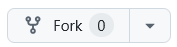 at the top of the page. 
  - Give your map a name, or stick with the default `gitRmap`
  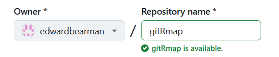
  - Click 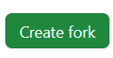

## Setup GitHub Pages
  - Click **Settings > Pages**
  - Source should be set to **Deploy from Branch**
  - Set Branch to `main`
  - Set the folder to `/docs`
  - It should look like this:
  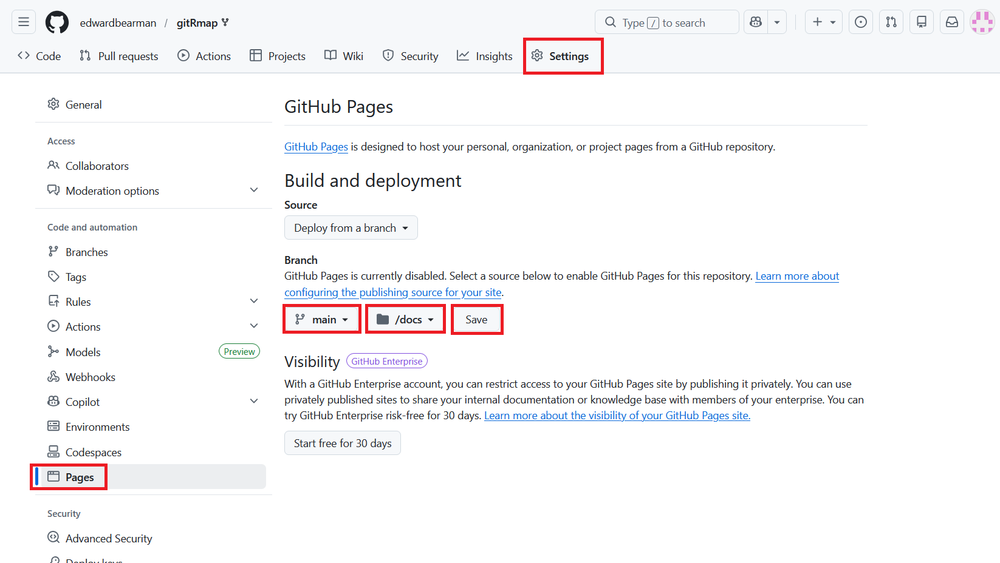
  - Click **Save**.

## Setup GitHub Actions  
  
  - Go to **Actions**
  - Click **I understand my workflows, go ahead and enable them.**
  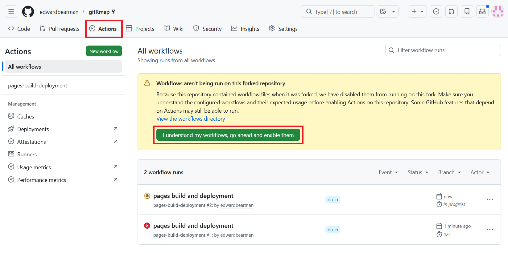

## Update `data/locations.csv`
  - Edit the `locations.csv` in the `data` folder to trigger the GitHub actions and run the R code to generate the map. 
  
  - Just to test everything is working, click **Edit**, and delete one of the rows. 
  
  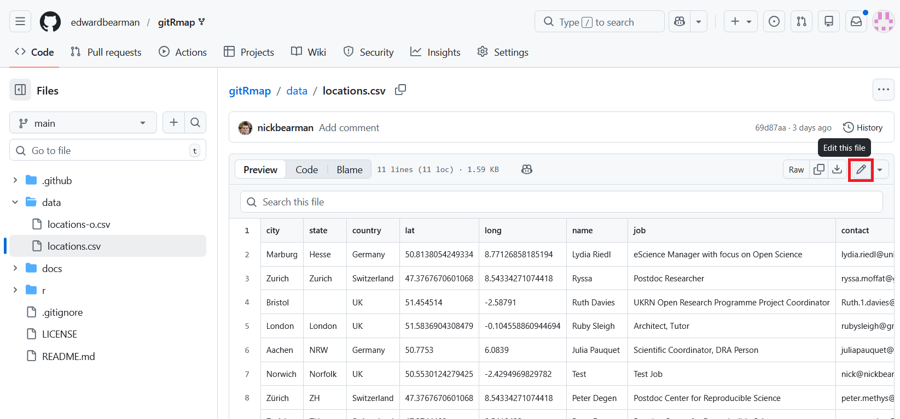
  
  - Commit the changes as normal
  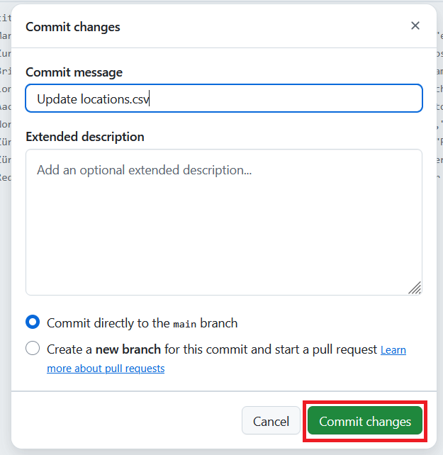
- *More details on the options here*

## GitHub Action Running

- Go back to your repo home page. A brown dot next to the commit means the GitHub Actions is running:

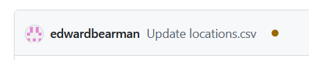

- You can just let it run now. It shouldn't take more than a minute to complete. 

- When it is finished, it will come up with a green tick:
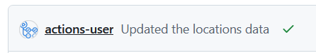
- If you want to, you can get more details. Click on the brown dot and it will take you to the Actions tab.

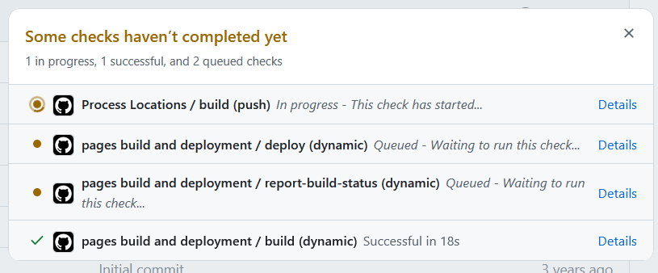

- You can click on each job and it will tell you the details. 

- When it is complete, go to **https://(username).github.io/gitRmap/** to see your map.

- If you can't find the link, click **Settings** > **Pages**. It will show you the address and you can click to **Visit Site**. 

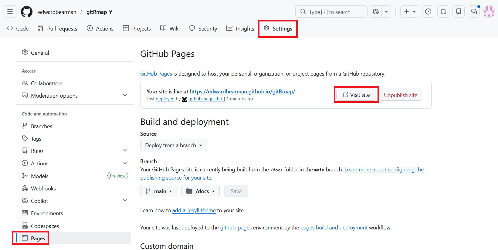

## What do I do now?

Once you have the example map up and running, you have two things to do:

- Update the `locations.csv` file to show the points on the map you want. Remember you only need to fill out `city`, `state` and `country`. Just leave `lat` and `long` blank and R will automatically fill out the coordinates. 

- Remove all the extra bits from `index.html` so it just shows the map, or whatever you want. Also remember to update the page title! See the comments in `index.html` for more help. 

## What about popups?

*to follow*

## Help! I got an error

- If you get a red cross, it means something went wrong:
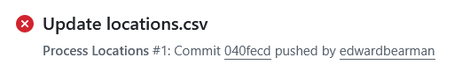
- Do not worry! It is probably an easy fix. 

- Click on the name and it will take you to the **Actions** page:

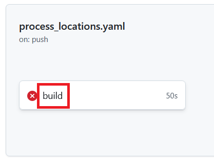

- Click on **build** and it will show you where the error was:

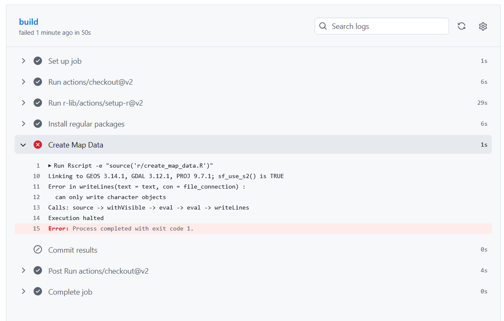

In this case there was a problem with the R code. I had to tweak the code and all was fine. Try working out the problem yourself. If you think it is a problem, please submit an [Issue](https://github.com/nickbearman/gitRmap-docs/issues/new) and I will have a look. 

If you do get an error, and manage to solve it, you can edit `locations.csv` to re run the build, or you can go to **Actions** and click **Re-run jobs > Re-run all jobs**:

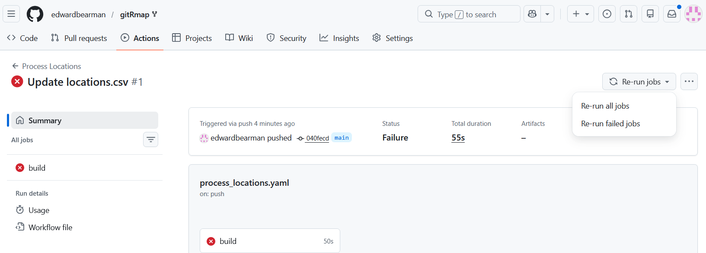

## What about updates?

If I update the gitRmap repo, then you will get a message at the top of your repo saying *This branch is 1 commit ahead of `nickbearman/gitRmap:main`*. This means I have changed the code, but your fork doesn't have that update. 

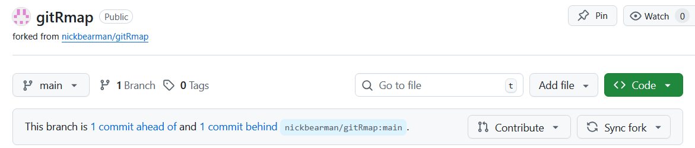

To get the update, click **Sync Fork** and choose **Update branch**:

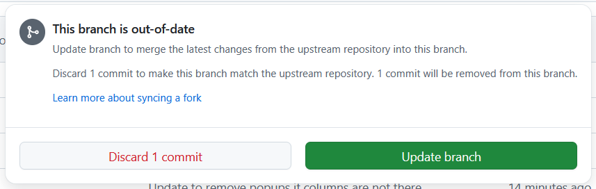

The new code will then be copied to your repo. 
