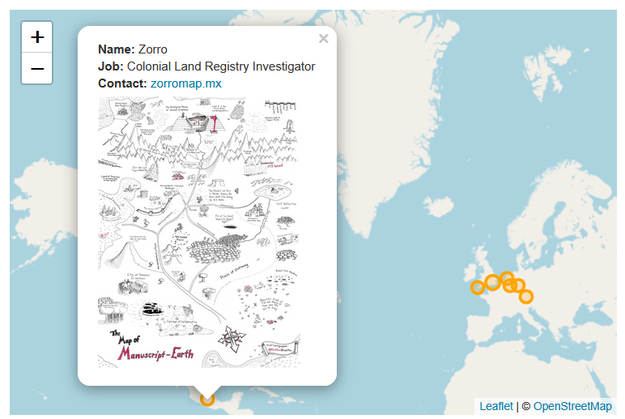

### Overview - How do I edit the attribute data shown?

The attribute data shown in the popup (Name, Job, Contact etc.) is dynamically created based on the columns in `locations.csv`. The standard column are `city`, `state`, `country`, `lat` and `long`. If you have no other columns, there will be no popup. (Rename `locations-no-popup.csv` to `locations.csv` and see what happens). If you have extra columns, they will appear in the popup. The column named `contactlink` will be rendered as a HTML link. 

### Removing Popups

To remove the popups from the map, remove all the extra columns, so you only have `city`, `state`, `country`, `lat` and `long`. Then no popup will be created. See an example in [`locations-no-popup.csv`](https://github.com/nickbearman/gitRmap/blob/main/data/locations-no-popup.csv). 

### Adding Images

You can add images to the popup if you want to. To do this, add a column called `image` into the `locations.csv` file. Fill this with either a URL to an image, or an image file (which can be stored in `docs/images`). This will be automatically added to the map. 

The size of the image is set in `index.html`, currently line 285:

`parts.push("");`

You can adjust the max width. 200px is the default. 

